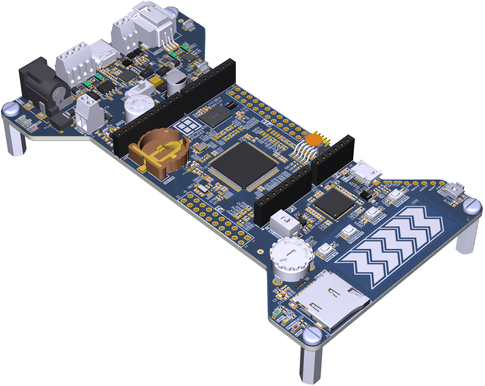

# RutDevKit-PSoC62 BSP

Rutronik Development Kit Programmable System-on-Chip CY8C6245AZI-S3D72 Board Support Package. 

 

------

### MODIFICATION:

1. Import RutDevkit-PSoC62 as existing project into yours workspace.
2. Do all the changes needed with configuration files etc.
3. Build the whole project.

### USE THE BSP:

1. Open The Project Creator: File --> New --> ModusToolbox Application
2. Browse the BSP location: The folder inside the  TARGET_RutDevKit-PSoC62 must be selected for a custom BSP usage.
3. Proceed with selecting "Empty PSoC6 App" or any compatible project example. 
4. Finish generating/importing the project.

## LEGAL DISCLAIMER

The evaluation board including the software is for testing purposes only and, because it has limited functions and limited resilience, is not suitable for permanent use under real conditions. If the evaluation board is nevertheless used under real conditions, this is done at one’s responsibility; any liability of Rutronik is insofar excluded. 

